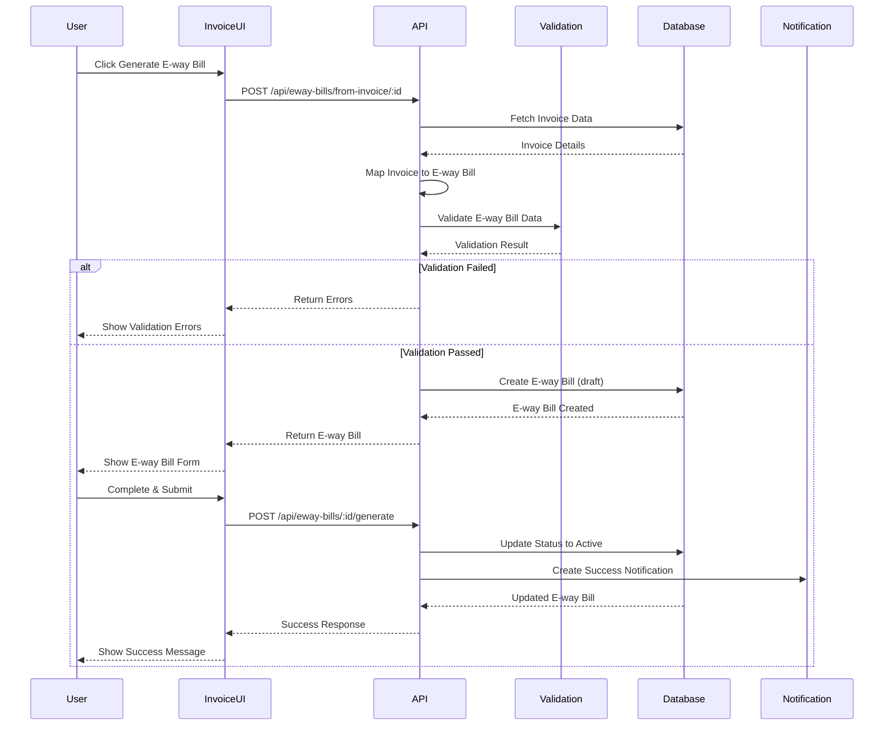
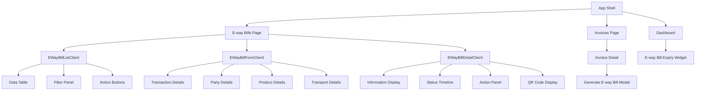
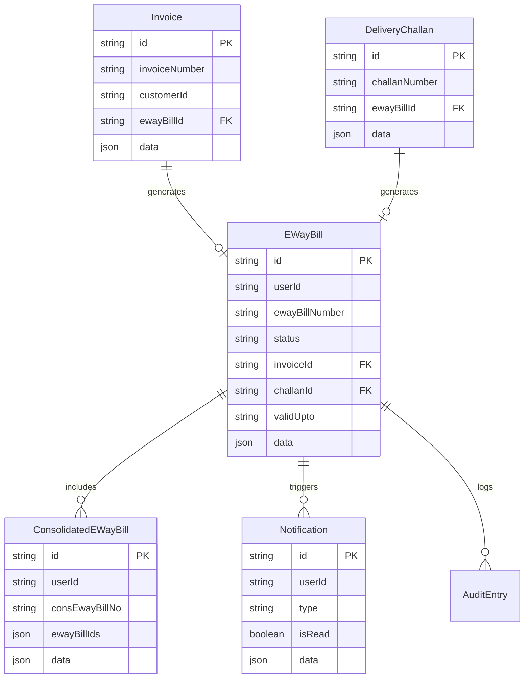
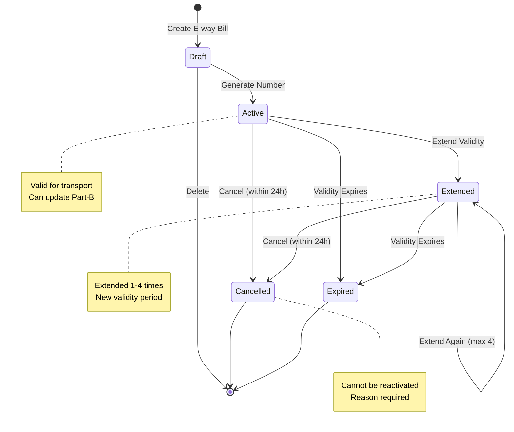
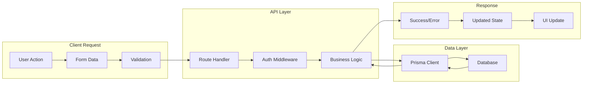
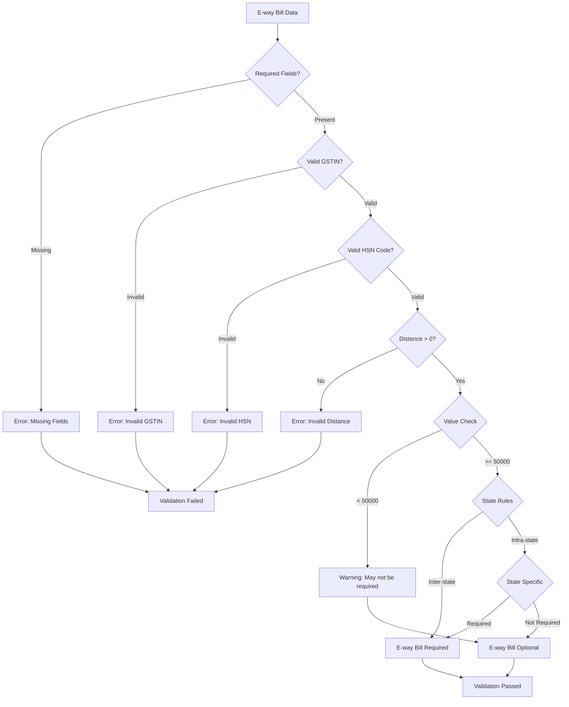
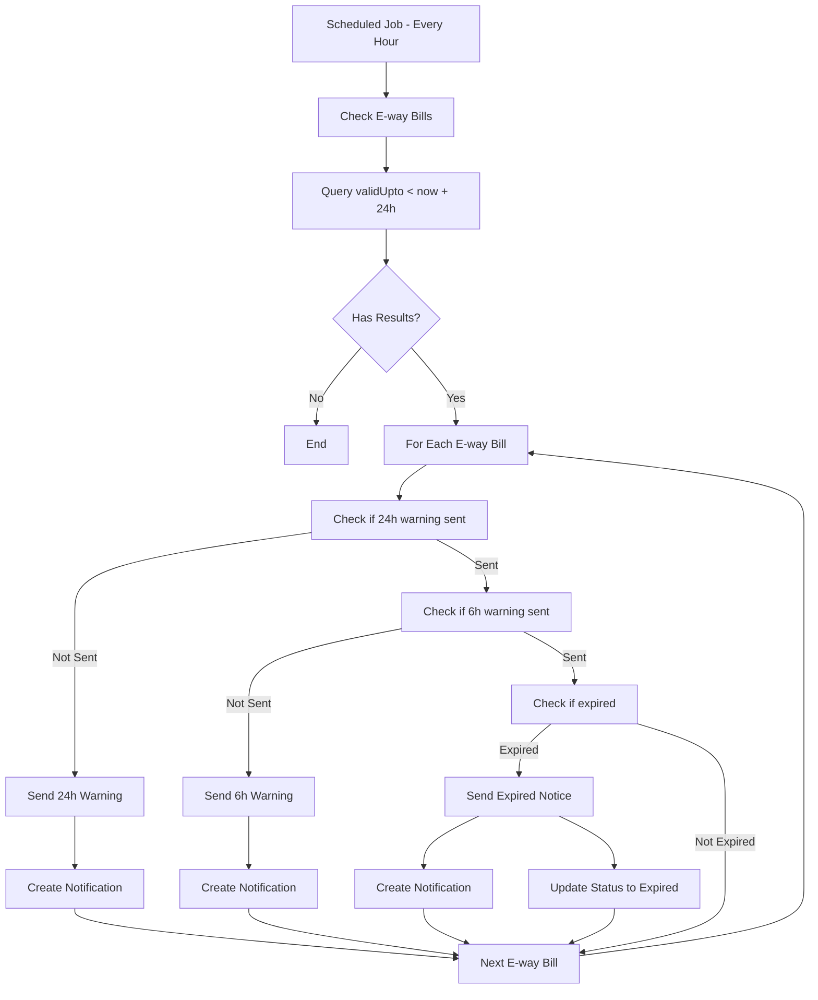
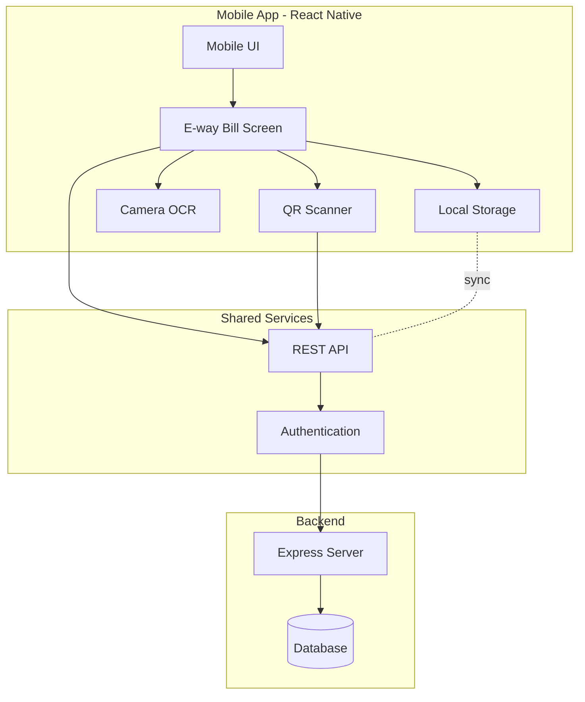
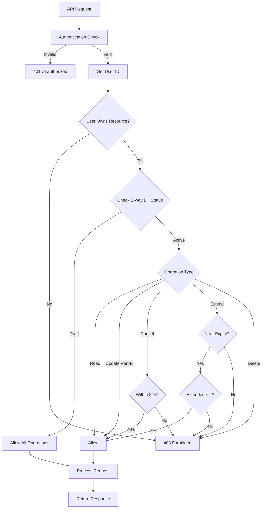
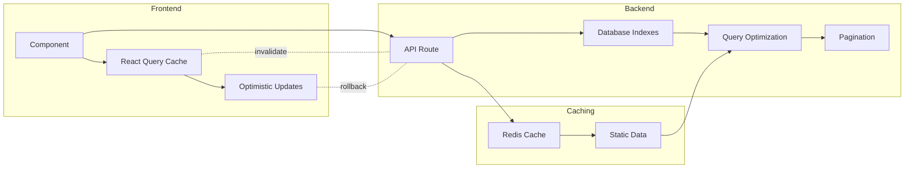

# E-way Bill Feature - Architecture Diagrams

## System Architecture Overview

```mermaid
graph TB
    subgraph "Frontend - Next.js"
        UI[User Interface]
        EWBList[E-way Bill List]
        EWBForm[E-way Bill Form]
        EWBDetail[E-way Bill Detail]
        InvUI[Invoice UI]
        ChalUI[Challan UI]
    end
    
    subgraph "Backend - Express API"
        API[API Routes]
        EWBRoute[/api/eway-bills]
        InvRoute[/api/invoices]
        Validation[Validation Logic]
        Business[Business Rules]
    end
    
    subgraph "Database - SQLite/Prisma"
        EWBTable[(EWayBill Table)]
        ConsTable[(ConsolidatedEWayBill)]
        InvTable[(Invoice Table)]
        ChalTable[(Challan Table)]
        NotifTable[(Notification Table)]
    end
    
    subgraph "Services"
        PDF[PDF Generator]
        QR[QR Code Generator]
        Notif[Notification Service]
        Valid[Validity Calculator]
    end
    
    UI --> EWBList
    UI --> EWBForm
    UI --> EWBDetail
    UI --> InvUI
    UI --> ChalUI
    
    EWBList --> API
    EWBForm --> API
    EWBDetail --> API
    InvUI --> API
    
    API --> EWBRoute
    API --> InvRoute
    EWBRoute --> Validation
    EWBRoute --> Business
    
    Business --> Valid
    Business --> Notif
    
    EWBRoute --> EWBTable
    EWBRoute --> ConsTable
    InvRoute --> InvTable
    
    EWBTable -.link.- InvTable
    EWBTable -.link.- ChalTable
    
    EWBDetail --> PDF
    EWBDetail --> QR
    
    Notif --> NotifTable
```

## Data Flow - E-way Bill Generation from Invoice



## Component Hierarchy



## Database Relationships



## State Management Flow



## API Request/Response Flow



## Validation Pipeline



## Notification Trigger Flow



## Mobile App Architecture



## Security & Access Control



## Performance Optimization Strategy



